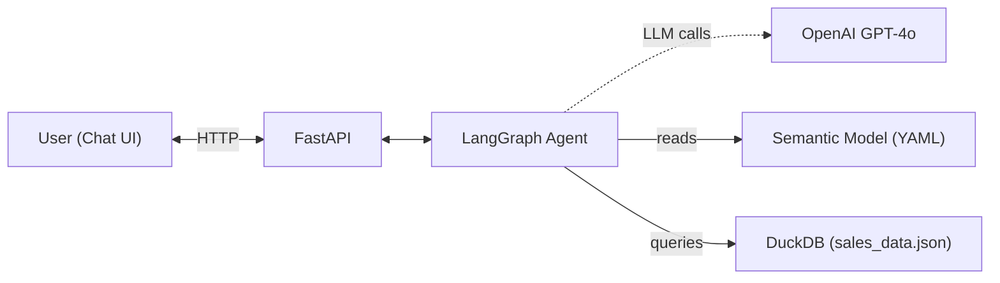
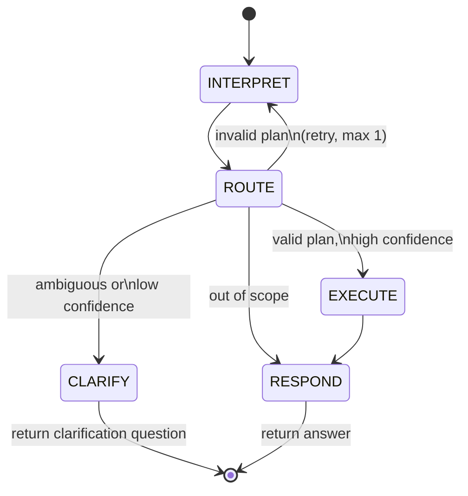

# Semantic Query Agent

[](https://github.com/YauheniMikevich/semantic-query-agent/actions/workflows/ci.yml)

> **Portfolio project** -- a take-home assignment for a job application. See [TASK.md](TASK.md) for the original task description.

A LangGraph-based agent that translates natural language questions about vehicle sales into SQL queries against a semantic model, executed on DuckDB. Exposed via FastAPI with a minimal chat frontend.

**Tech stack:** Python 3.11, LangGraph, LangChain-OpenAI (GPT-4o), DuckDB, FastAPI, Pydantic, Poetry

## Architecture



### Agent State Machine



- **INTERPRET** — LLM extracts a structured query plan (metrics, dimensions, filters, time range) and a confidence score from user input, grounded by the semantic model and its synonym map.
- **ROUTE** — Pure Python. Validates the query plan against the semantic model and checks the LLM's confidence score against a configurable threshold. Routes to EXECUTE (valid + confident), CLARIFY (ambiguous or low confidence), or RESPOND (out of scope). Retries INTERPRET once on validation failure.
- **EXECUTE** — Deterministic SQL builder maps query plan fields to SQL expressions from the YAML model. No LLM-generated SQL.
- **CLARIFY** — Returns a follow-up question. The graph exits; the next user message re-enters at INTERPRET with full history.
- **RESPOND** — LLM formats query results into a natural language answer, or handles out-of-scope/error cases.

Only INTERPRET and RESPOND call the LLM. ROUTE and EXECUTE are deterministic.

### Semantic Model

The YAML model (`semantic_model.yaml`) defines metrics, dimensions, time periods, and synonyms for a vehicle sales dataset. It serves dual purpose: LLM grounding in the system prompt and SQL expression source for the builder.

## Getting Started

### Prerequisites

- Python 3.11+
- [Poetry](https://python-poetry.org/)
- OpenAI API key

### Setup

```bash
# Install dependencies
poetry install

# Configure environment
cp .env.example .env
# Edit .env and add your OPENAI_API_KEY
# Optional: set CONFIDENCE_THRESHOLD (default 0.7) to tune
# how aggressively the agent asks for clarification
```

### Run

```bash
make run
# → starts uvicorn on http://localhost:8000
```

Open http://localhost:8000 in your browser for the chat UI.

### Run Test Questions

Process all 5 test questions from `test_questions.json` and print structured results (interpretation, query results, natural language summary):

```bash
make demo
```

### Docker

```bash
# Make sure .env is configured, then:
docker compose up --build
```

### API

- `POST /query` — `{ "session_id": "...", "message": "..." }` → `{ "response": "..." }`
- `GET /health` — health check

### Test & Lint

```bash
make test    # pytest
make lint    # black + isort + flake8
```

## Project Structure

```
semantic_query_agent/
├── main.py              # FastAPI app, endpoints, startup
├── agent.py             # LangGraph state machine, nodes
├── models.py            # Pydantic models (state, query plan, API schemas)
├── prompts.py           # System prompts for INTERPRET and RESPOND nodes
├── sql_builder.py       # QueryPlan → SQL string
├── semantic_model.py    # YAML loader
├── database.py          # DuckDB setup, loads sales_data.json
└── config.py            # Pydantic BaseSettings from .env
static/
└── index.html           # Chat frontend (vanilla JS)
tests/
├── conftest.py          # Shared fixtures (semantic_model, db_conn)
├── test_agent.py        # Agent flow tests (clear, ambiguous, out-of-scope, retry)
├── test_api.py          # FastAPI endpoint tests
├── test_database.py     # Database loading tests
├── test_semantic_model.py
└── test_sql_builder.py
semantic_model.yaml      # Metrics, dimensions, time periods, synonyms
sales_data.json          # Vehicle sales dataset
test_questions.json      # Golden set of test questions
run_test_questions.py    # Demo script: runs test questions end-to-end
```

## Limitations

- **No persistence** — sessions are in-memory; server restart clears all conversation history
- **No authentication or rate limiting**
- **No streaming responses** — full response returned after all processing completes
- **Single-process** — in-memory session store doesn't scale horizontally
- **Time periods are computed relative to the dataset's max date**, not the current wall clock
- **DuckDB dialect only** — the YAML model uses Snowflake syntax (`TO_CHAR`), which the SQL builder translates to DuckDB equivalents (`STRFTIME`) at runtime
